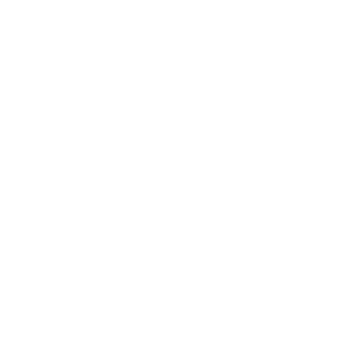
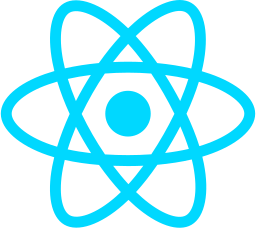
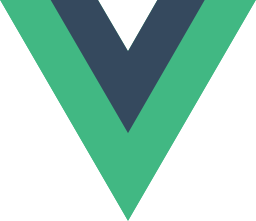

# Hi there 👋

I'm a 24 years old fullstack web developper from France.
I'm student at the Center for Education and Research in Computer Science in Avignon.

## Skills

- **Languages** : Typescript, JavaScript, PHP, HTML, CSS, ...
- **Frameworks** :

&nbsp;&nbsp;&nbsp;

&nbsp;&nbsp;&nbsp;

&nbsp;&nbsp;&nbsp;

&nbsp;&nbsp;&nbsp;

&nbsp;&nbsp;&nbsp;

- **Databases** : MySQL, PostgreSQL, MariaDB, MongoDB
- **Environment** : Docker, Git
