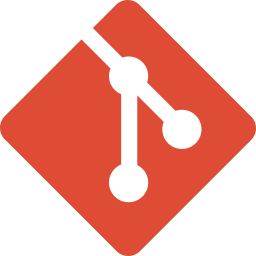

# 👋 Welcome on my profile

I'm a 24 years old fullstack web developper from France.
I'm student at the Center for Education and Research in Computer Science in Avignon.

## Skills

- **Languages** :

    <picture></picture>
    &nbsp;&nbsp;&nbsp;&nbsp;&nbsp;&nbsp;
    <picture></picture>
    &nbsp;&nbsp;&nbsp;&nbsp;&nbsp;&nbsp;
    <picture></picture>
    &nbsp;&nbsp;&nbsp;&nbsp;&nbsp;&nbsp;
    <picture></picture>
    &nbsp;&nbsp;&nbsp;&nbsp;&nbsp;&nbsp;
    <picture></picture>

- **Frameworks** :

    
    &nbsp;&nbsp;&nbsp;&nbsp;&nbsp;&nbsp;
    
    &nbsp;&nbsp;&nbsp;&nbsp;&nbsp;&nbsp;
    
    &nbsp;&nbsp;&nbsp;&nbsp;&nbsp;&nbsp;
    
    &nbsp;&nbsp;&nbsp;&nbsp;&nbsp;&nbsp;
    
    &nbsp;&nbsp;&nbsp;&nbsp;&nbsp;&nbsp;
    

- **Databases** :

    
    &nbsp;&nbsp;&nbsp;&nbsp;&nbsp;&nbsp;
    
    &nbsp;&nbsp;&nbsp;&nbsp;&nbsp;&nbsp;
    
    &nbsp;&nbsp;&nbsp;&nbsp;&nbsp;&nbsp;
    

- **Environment** :

    
    &nbsp;&nbsp;&nbsp;&nbsp;&nbsp;&nbsp;
    

